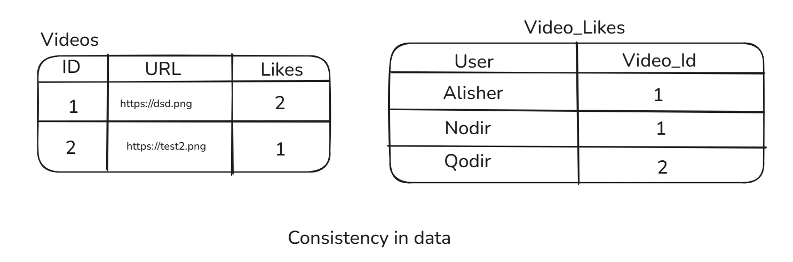

# Consistency

**Ma’lumotdagi consistency** sizda saqlanayotgan ma’lumot siz tuzgan modelga mos bo‘lishini anglatadi. Odatda bu dasturchi tomonidan yaratiladi, ya’ni databaza sxemasi orqali ta’minlanadi. Bu yerda bo‘ladigan eng katta muammo **referential integrity** (foreign keys), ya’ni jadvallarni bir-biriga bog‘lab turadigan id’lar bilan bog‘liq xatolardir. Ba’zilar **NoSQL**’da bunday muammo yo‘q deb aytishi mumkin, ammo NoSQL’da ikki document orasida aloqani bog‘lab berolmaslik ham shu muammoga kiradi. Ma’lumotdagi consistency’ni ushlab turish uchun **Atomicity** ham kerak bo‘ladi. Masalan, biz debit qilayotganda databaza crash bo‘lib qolsa, hamma narsa o‘z holiga qaytishini atomicity ta’minlaydi. Agar bunday bo‘lmasa, oldingi maqolada aytib o‘tganimizdek, pul shunchaki havoda yo‘q bo‘lib ketadi va bu ma’lumot **corrupted** deyiladi. Shuningdek, **Isolation** ham **inconsistent** ma’lumot olishga sabab bo‘lishi mumkin. Oldingi maqolada ko‘rganimizdek, isolation level’ga qarab bir tranzaksiyadagi query’lar ikki xil natija berishi mumkin (***inconsistent***). Bu holatda databazadagi ma’lumotlar consistent bo‘ladi, ammo isolation tufayli inconsistency yuzaga keladi.

### Asosiy sabablar

- Tepadagi 2 rasmda consistent va inconsistent ma’lumotlar ko’rsatilgan. 2-rasm inconsistent bo’lishining sababi:
    1. 1 video 9 like to’plagani ko’rsatilmoqda ammo likes jadvali u videoda faqatgina 2ta like borligini aytomoqda.
    2. hamda likes jadvali Nodir 6 idlik videoga like bosdi demoqda ammo video jadvalida 6 idlik video mavjud emas.

Bu inconsistent ma’lumot.
